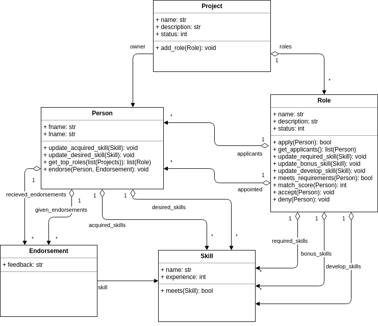

# Technical Exercise

### Note 
The code is intended for Python 3. Given the nature of this assignment I thought I would try out using the Python type annotations to make the types correspond to the UML diagram.

The test can be run by using `python3 test.py` It is all text output to show how the application could be used.

### Assumptions
* in the current design some operations are not supported or slow. An example of this is finding who endorsed a person from an endorsement. 
Currently it requires searching all Persons `given_endorsements`. These operations could be sped up by using additional data structures such as 
a dictionary containing endorsements and endorser and endorsed.
* `experience_rating` is some numeric value that could be possibly self reported as well as used by an endorser.
* an endorser will give feedback on multiple skills for a project
* a person can apply for a role even if they they do not meet all the requirements
* scoring function isn't good its just for fun

### User Retention 
Two ideas for user retention that are mostly used by other websites. One notifying users by email when an opportunity that matches
their skills and developing skills. This is used by most job boards and is probably effective but also annoying for the user.

Second, some sort of achievement and badge system seems to be employed by some websites. You get points and badges for accomplishing 
different tasks such as daily log ins, posts, applications etc... These are displayed on your profile for others to see. Not sure how
effective this is. 

Finally, most people are not constantly looking to jump teams all the time. Therefore users may only log in for some period in time 
while they look for a new team. They need another reason to log in daily. This could be team blogs and news feeds that can be used to 
advertise team success or challenges and attract new talent. 